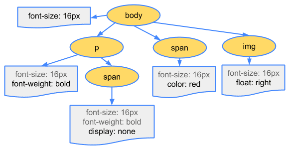

## Render Blocking - CSS

CSS is render blocking as its blocks rendering of parsed content until CSS Object Model (CSSOM) is constructed.
The browser does this to prevent Flash of Unstyled Content (FOUC)

- Render-blocking resources, like CSS, **used to** block all rendering of the page when they were discovered.
- Some browsers (Firefox initially, and now also Chrome) only block rendering of content below the render-blocking resource.
<!-- ## Process -->

<!--  -->

### Code for the CSSOM

```css
body {
  font-size: 16px;
}
p {
  font-weight: bold;
}
span {
  color: red;
}
p span {
  display: none;
}
img {
  float: right;
}
```

## Strategy to load CSS

### Explicitly mark CSS as render-blocking

`blocking=render` attribute, added to Chrome 105. This allows developers to explicitly mark a `<link>`, `<script>` or `<style>` element as rendering-blocking until the element is processed, but still allowing the parser to continue processing the document in the meantime.

### Marking CSS as Non Render Blocking

Although CSS is render-blocking by default, it can be turned into a non-render-blocking resource by changing the `<link>` element's media attribute to specify a value that doesn't match the current conditions: `<link rel=stylesheet href="..." media=print>`. This has been used in the past to allow non-critical CSS to load in a non-render blocking fashion.

## References

- [HTML Spec - Blocking Attribute](https://html.spec.whatwg.org/multipage/urls-and-fetching.html#blocking-attributes)
- [Constructing the Object Model](https://web.dev/articles/critical-rendering-path/constructing-the-object-model)
