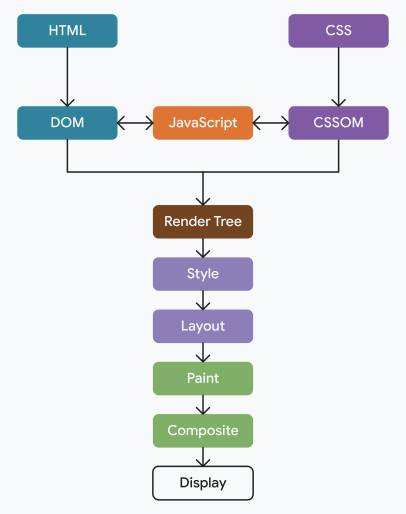

Add details here

## Flow

- Constructing the Document Object Model (DOM) from the HTML.
- Constructing the CSS Object Model (CSSOM) from the CSS.
- Applying any JavaScript that alters the DOM or CSSOM.
- Constructing the render tree from the DOM and CSSOM.
- Perform style and layout operations on the page to see what elements fit where.
- Paint the pixels of the elements in memory.
- Composite the pixels if any of them overlap.
- Physically draw all the resulting pixels to screen.

<!--  -->

## Resource Loading

- CSS is render blocking
- Scripts are parser blocking
- Browsers have a preload scanner, that can continue to download resource, while waiting on blocked resources

## References

- [MDN](https://developer.mozilla.org/en-US/docs/Web/Performance/Critical_rendering_path)
- [Understanding the critical path](https://web.dev/learn/performance/understanding-the-critical-path)
- [Optimizing Resource Loading](https://web.dev/learn/performance/optimize-resource-loading)
- [Optimizing the Critical Rendering Path](https://web.dev/articles/critical-rendering-path/optimizing-critical-rendering-path)

#### From ByteByteGo

- Downloaded from [Alex Xu](https://twitter.com/alexxubyte/status/1534201523713867777) Twitter post.

