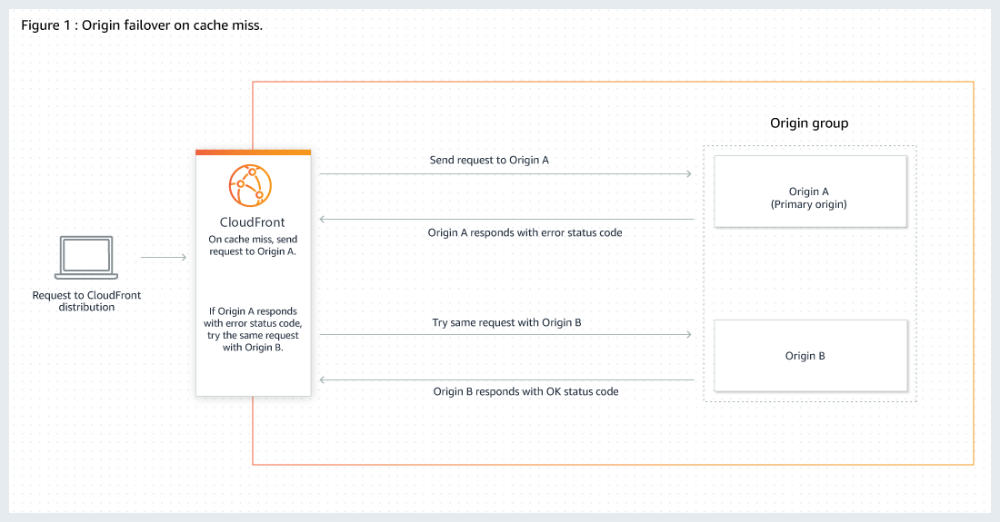

## Introduction

In the dynamic landscape of e-commerce, delivering a seamless user experience hinges on the efficient handling of images, especially within a responsive design framework. Serving diverse images to users based on screen resolution, pixel density, and other parameters is paramount for optimal performance. While third-party image services like Cloudinary are common, relying solely on external services can introduce availability problems.

Eg: 10 service with 99.99 availability (~52m of outage) will give a 99.90% (~8h 41m) available system.

This blog delves into our journey of addressing these challenges by integrating Amazon S3, CloudFront, and Lambda@Edge into our image service architecture.

## The Image Service Outage

A substantial one-hour outage and subsequent six hours of degraded performance led us to reassess our image service strategy. Recently incorporating our Content Delivery Network (CDN), we aimed to mitigate network bandwidth consumption and associated costs by serving most images from cache rather than the origin. This helped us also during the outage, since most of the images were being served by the CDN's cache.

## Building a Fallback Storage with S3

Integrating S3 as a fallback storage for query parameter-based transformations posed multiple challenge.

- S3 stores files with respect to prefix, and doesn't support query parameters to server different files.
- There could be too many variants requested by the web application, we can not sync all the possible variations
- Reduce the storage and time to sync the images

### Addressing Query Parameters

To overcome this, we established a pattern for file paths based on query parameters, transforming, for example, `x.jpeg?w=1000&q=50&fm=webp` to `x.jpeg/w_1000_q_50.webp` during file synchronization. Leveraging a CDN with Lambda@Edge origin interceptor, we seamlessly converted query parameters into the specified pattern during retrieval.

### Managing Image Variants

To streamline image variants and minimize storage complexities, we limited support to two parameters: width and quality. Height defaulted to auto for aspect ratio maintenance, and the format standardized to webp for optimized compatibility. Our Lambda@Edge was updated to dynamically adjust to supported parameter values, ensuring efficient image delivery with just 10 variants and a single origin image.

Eg. If we have variants of images with increasing hights of say 320px, 768px and 1024px. If the user requests for 1000px, we will serve the image with 1024px, since it is the nearest better quality images. This would not be as efficient as the original image service, but will provide good UX at slightly more bandwidth consumption.

### Reducing Memory Usage of Sync Job

Optimizing the memory usage of the sync job involved fetching existing images on S3 and processing only those not already uploaded. Additionally, we optimized image processing by implementing streaming, improving the efficiency of the sync job.

```js
// Example using Node.js and axios
import { PassThrough } from "stream"
import axios from "axios"
import { Upload } from "s3-stream-upload"

export async function syncImage(downloadUrl, uploadUrl, { format = "webp", width, height, quality = "50" } = {}) {
  const sourceImageResponse = (await axios.get) < Stream > (downloadUrl, { responseType: "stream" })
  const passThrough = new PassThrough()
  sourceImageResponse.data.pipe(passThrough)

  const upload = new Upload({
    client: s3Client,
    params: {
      Bucket: AWS_S3_BUCKET,
      Key: uploadUrl,
      ContentType: `image/${format}`,
      Metadata: {
        format,
        width,
        height,
        quality,
      },
      Body: passThrough,
    },
  })

  await upload.done()
}
```

### Fallback Storage Summary

A cron job was implemented for incremental synchronization of images from our CMS to the S3 bucket. This S3 bucket, integrated with CloudFront and a Lambda@Edge origin request interceptor, adeptly transformed query parameters into a path format, ensuring efficient image delivery.

### Setting Up Failover

To further enhance availability, we modified the original CDN serving from the image service and added a failover origin—the fallback storage. Leveraging CloudFront's origin group feature, we established a robust failover mechanism.



## Conclusion

The integration of Amazon S3, CloudFront, and Lambda@Edge emerged as a pivotal solution for overcoming challenges posed by an image service outage. Our strategic approach not only boosted image service availability but also optimized image storage and delivery, ultimately enhancing the overall user experience. Leveraging these AWS services ensures a resilient, cost-effective, and scalable solution for future e-commerce requirements.

## Reference

- [MDN Responsive Images](https://developer.mozilla.org/en-US/docs/Learn/HTML/Multimedia_and_embedding/Responsive_images)
- [lambda@edge AWS](https://docs.aws.amazon.com/AmazonCloudFront/latest/DeveloperGuide/lambda-at-the-edge.html)
- [Optimizing high availability with CloudFront origin failover](https://docs.aws.amazon.com/AmazonCloudFront/latest/DeveloperGuide/high_availability_origin_failover.html)
- [Uptime](https://uptime.is/)
