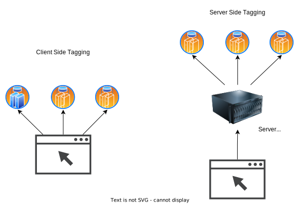

## Implementation

### Configuring Web Container with GA4 Client

A Web Container with a single GA4 tag is set up. This component is responsible for sending relevant events to the Server Container, creating a seamless integration between the two environments.

When configuring the tag, `Configuration settings` will have following settings

| Configuration Parameter | Value                    |
| ----------------------- | ------------------------ |
| server_container_url    | https://track.sujeet.pro |

In your application, this tag will send the data to the configured target.
Note down the `Tag Id`, which we will need later.

### Creating a Server Container

The journey begins with establishing a server container, hosted on the robust Google Cloud Platform (GCP). This server container becomes the epicenter of your tracking operations and can even be mapped to a custom domain, such as `tracking.sujeet.pro`.

A Server container has two important parts

- Clients: Responsible for reciveing the events
- Tags: Responsible for sending the events.

### Configuring Clients for Server Container

Clients are respoinsible for receiving events from the origin sources. For our use case, we will configure a single client (GA4).
While configuring the client, you will need to provide Measurement ID, which is Tag Id from the GA4 tag of web container

### Configuring Tags in the Server Container

Once the server container is in place, the next step involves configuring tags within it for various 3rd party analytics services. This centralized control allows for a streamlined management process, making updates and modifications more efficient.

For tags, you have template gallary, where you have tag template for nearly all the 3rd party analytics service.

## Benifits of Server Side Tag Manager

### Fewer HTTP Requests

One of the primary advantages of Server-side GTM is the reduction in HTTP requests. Unlike its client-side counterpart, Server-side GTM consolidates multiple requests into a single streamlined request to the server, optimizing performance and resource utilization.

### Lighter Browser Load

By offloading the tracking scripts to the server, the visitor's browser is spared from script overload. This results in a lighter browser load, allowing it to focus on rendering the page and delivering a smoother, faster user experience.

### Faster Initial Page Load

With the heavy lifting moved to the server, the initial page load becomes faster. Users experience quicker access to content, satisfying their desire for instant gratification and positively impacting user engagement.

### Enhanced Data Security

Server-side GTM enhances data security by keeping data under your control and transmitting it through secure server connections. This minimizes the risk of privacy breaches and ensures that sensitive information remains protected.

### Greater Flexibility

The shift to Server-side GTM opens up new possibilities for tracking configurations. Engineers can create more complex setups and even build custom server-side extensions, providing greater flexibility and customization options.

### Improved Data Accuracy

Server-side GTM eliminates the challenges posed by browser inconsistencies, ensuring a more accurate and reliable data collection process. This contributes to better-informed decision-making based on trustworthy analytics data.

## Client Vs Server Side Tagging

## References

- [Google Developer Docs](https://developers.google.com/tag-platform/tag-manager/server-side)
- [Stape Blog](https://stape.io/blog/improving-website-page-speed-with-the-help-of-google-tag-manager-server-side-tracking)
- [Server Vs Client Side Tagging](https://stape.io/blog/server-side-tagging-versus-client-side-tagging)
