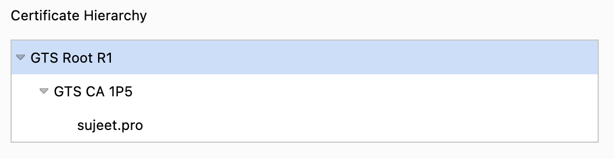

When an user hits an url in the browser, there are lot of steps that happens.
At each step, we can improve performance, resulting in better TTFB and consequently other metrics

## DNS Resolution

Latency in the context of DNS resolution refers to the time delay experienced from the moment a DNS query is made until the response is received.

You can use tools like dnsperf.com to measure DNS lookup time around the world. Eg. for [sujeet.pro](https://www.dnsperf.com/dns-speed-benchmark?id=mt88szlu474i5c)

### Improving DNS Resolution

- Reduce number of DNS Lookup
  - Reduce no. of hostname
  - Consolidate Resources
  - Use a CDN
  - Host 3rd party resources locally (on your own CDN)
- Use DNS Cache, Configure TTL wisely
  - CNAME - 24hrs
  - A/AAAA - 5mins to 60mins
  - TXT/MX - 12hrs
- Minimize number of CNAME records
  - Instead of waterfall CNAME records, prefer using A records
- Use a Fast DNS Provider

#### DNS Resolution For future requests on a page

- Use DNS Prefetch for
  - Using HTML Meta tag:
    `<link rel="dns-prefetch" href="https://fonts.googleapis.com/" />`
  - Using Header:
    `Link: <https://fonts.googleapis.com/>; rel=dns-prefetch`

## TCP Connection

## Securing your TCP connection (HTTPS)

- Optimize the Certificate Path

## Choosing between HTTP version

## Reducing Latency

### Using AnyCast
